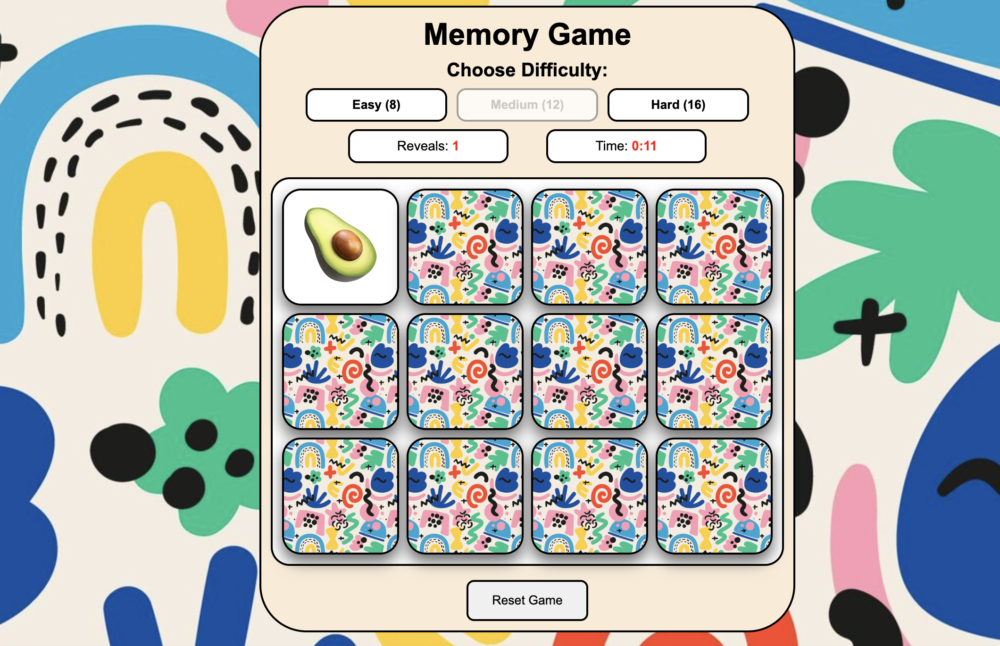
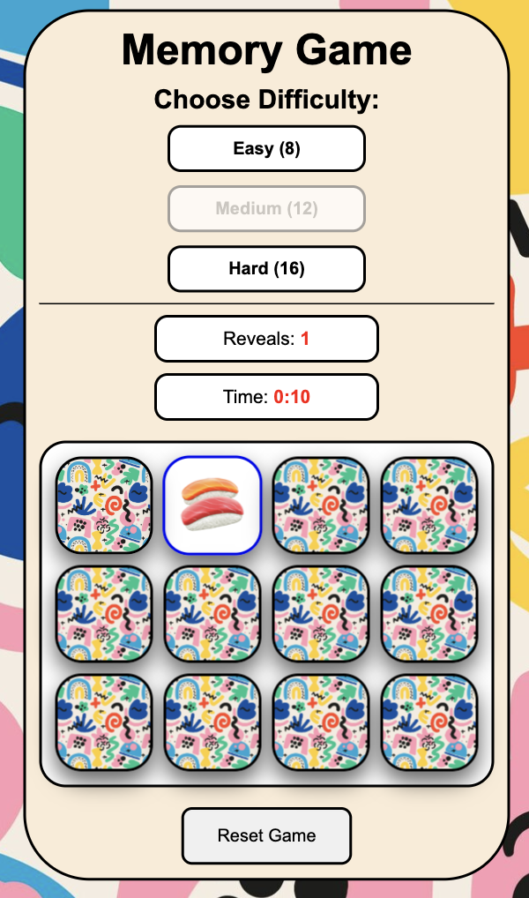

# 🧠 Memory Game

A classic ***Memory Card Game*** built with ***JavaScript***, featuring a backend and database for dynamic card data, responsive design, and multiple difficulty levels.

---

## 🚀 Features

- ✅ **Backend & Database**
  - Cards are stored in a database and served via a backend API.
  - Easy to expand with new cards without changing frontend code.
- 📱 **Responsive Design**
  - Fully mobile-friendly layout.
  - Card sizes and grid layout adjust automatically for different screen sizes.
- 🎮 **Three Difficulty Levels**
  - Each level adjusts card size, grid gap, and game complexity.
- ⏱ **Game Mechanics**
	- Click cards to reveal emojis.
	- Match pairs to remove them.
	- Timer tracks your speed.
  - You can reset the cards at any time
  - Game ends when all pairs are matched.
 
---

## 🛠 Technologies Used

- **Frontend:** HTML, CSS, JavaScript (ES6+)
- **Backend:** Node.js, Express.js
- **Database:** SQLite
 
---
## 🔹 Screenshot

Desktop Version



Mobile Version



 ---
## 🔹 How to run

### 1️⃣ Install dependencies

```bash
cd server
npm install
```

###	2️⃣ Start backend:
  
```bash
npm start
```

### 3️⃣ Open the game in your browser

```bash
http://localhost:3000/
```
